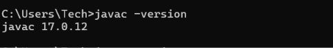

You can know your JDK version using below given command in cmd/powershell/git bash:

```
javac -version
```

I'm using 17.0.12 JDK version



After installing java you can run your first program given below.

```
import java.lang.System;
public class HelloWorld{
  public static void main(String args){
    System.out.println("Hello World!");
  }
}
```

1. for running the code you must have to create a file name same as you class name and start with captial character only.
2. in second step you create a static methods with public access modifier so java can run without any instance creation and access level restriction followed by return type as void and the methods name as main. java will call this main method as you code's entry point
3. then as parameter you must have to pass String args otherwise the code won't work(required though you are using it). args is an array of argument you provided while running you code with command line and passing some arguments to the code.
4. first line in this code is optinal in java which is used to import java native methods. so given that to print any thing in command line you need to import System(java does autoamtically) and print using command System.out.println followed by round paranthises.
5. to run this code you have to first compile it using `javac [FileName].java` ([fileName] - here you put your actual file name. eg. javac HelloWorld.java)
6. once you compile this file you will se an bytecode file created at the same level of file you have created by [fileName].class exetention ( eg. HelloWorld.class).
7. after successfully compilation. now you can run code using command `java [fileName]` (eg. java HelloWorld).
8. congratulations now you can see `Hello World!` printed in you console.
